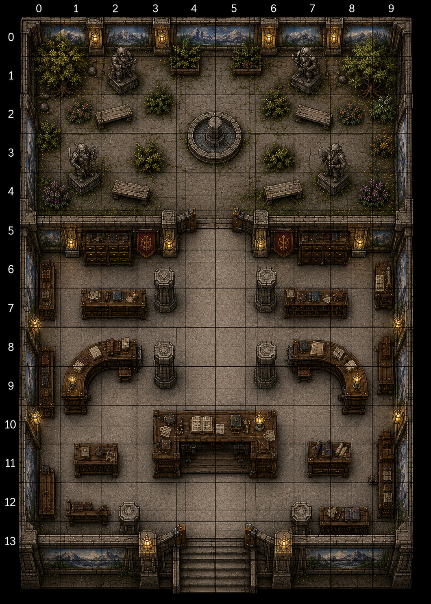
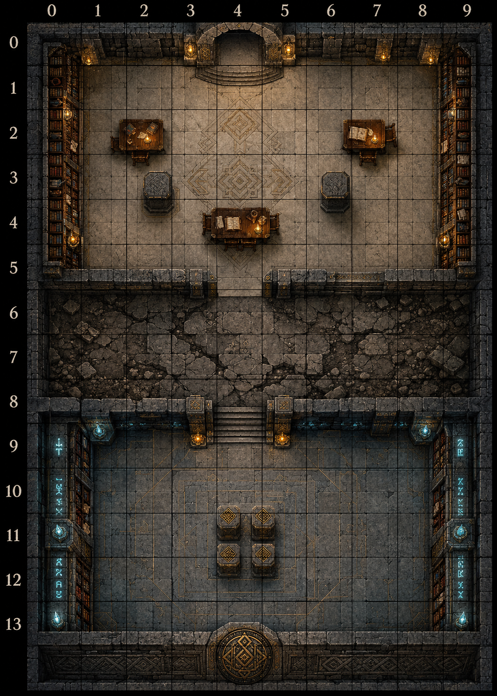

# Worked Example — The Great Library of Nalrock

A complete, real-world output of the `dnd-map-architect` skill: a two-sheet printable battlemap for a 5th-level retrieval raid through an abandoned dwarven library beneath Knowhere.

Both sheets are A3 portrait, 28 mm grid → exactly **10 × 14 squares** each.

## Demo Results

Generated from the copy/paste prompts below. Sheet 1 stacks above Sheet 2: the party enters the Reception through the **west door**, descends the **south stairs**, and arrives at the **north archway** of the Reading Hall on Sheet 2 — then crosses the cracked-floor **hazard band** to the sealed **vault** and its four-pedestal puzzle.

| Sheet 1 — Levels 1–2 | Sheet 2 — Levels 3–4 |
| --- | --- |
|  |  |
| Reception Hall (west entry) + the isolated Enclosed Garden. | Grand Reading Hall → hazardous transition → hidden Archive vault. |

> Image generators do not produce a mathematically exact grid. For print, overlay an exact 10 × 14 grid in post (see the printing notes in [`BATTLE-MAP-SUMMARY.md`](BATTLE-MAP-SUMMARY.md)).

## Files

- [`nalrock-sheet1.json`](nalrock-sheet1.json) — validated dungeon spec, Levels 1–2 (Reception entry + isolated garden).
- [`nalrock-sheet2.json`](nalrock-sheet2.json) — validated dungeon spec, Levels 3–4 (Reading Hall + hazard + hidden vault).
- [`chatgpt-prompt-sheet1.md`](chatgpt-prompt-sheet1.md) — copy/paste image prompt for Sheet 1.
- [`chatgpt-prompt-sheet2.md`](chatgpt-prompt-sheet2.md) — copy/paste image prompt for Sheet 2.
- [`BATTLE-MAP-SUMMARY.md`](BATTLE-MAP-SUMMARY.md) — topology graph, encounter plan, DM prep, and printing notes.
- `nalrock-sheet1.png`, `nalrock-sheet2.png` — example ChatGPT renders (above).

Both specs pass the validator with no errors or warnings:

```bash
.venv/bin/python skills/dnd-map-architect/scripts/validate_dungeon_spec.py examples/luminzest-nalrock-library/nalrock-sheet1.json
.venv/bin/python skills/dnd-map-architect/scripts/validate_dungeon_spec.py examples/luminzest-nalrock-library/nalrock-sheet2.json
```
